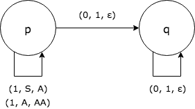

# Non Deterministic Pushdown Automaton Simulator

## Why do we use automata in Computer Science

In Computer Science we try to give answers to the following questions:

- What problems can we solve with an algorithm?
- How do we design an algorithm to solve a problem?
- Does the designed algorithm really solve the problem? Is there any error?
- How efficient is the algorithm in terms of time consumption and space needed?

Our first concern is to know if there exist an algorithm to solve a certain problem, this is because if the 
answer is negative we can't do anything else. In order to help with that, we use mathematical models of computation 
to represent algorithms: if we can get a model to solve a problem (being the problem defined in a formal language),
then we can be sure that there must exist an algorithm to solve the problem.

Lets say, for example, that our problem is determining whether a binary input string is made of a number of ones 
followed by the same number of zeroes or not. We can define the language made by all those strings as

_L={1<sup>n</sup>0<sup>n</sup> / n > 0}_
 
We can now solve the problem by determining whether an input string is part of the language or not. And we can do that
by using mathematical models like Pushdown Automata or Context-Free Grammars.

In case that our problem is not a decision problem (with "yes" or "no" answer) we'll need an output string, 
Turing Machines can transform the input and thus have an output associated with input strings. Turing Machines 
are models that can represent any computable algorithm.

## Pushdown Automata

A Pushdown Automaton (PDA) is a model that represent Context-Free languages, these languages are less rich than the 
ones that Turing Machine represents but they are widely used, for example for defining programming languages.

PDA are formally described by a 7-uple (Q, Σ, Γ, s, Z, δ, F):

- __Q__ is the finite set of states of the automaton.
- __Σ__ is called the input alphabet. It is the finite set of symbols that the input strings can be made of.  
- __Γ__ is called the stack alphabet. It is the finite set of symbols that the stack can have in it.
- __s__ is the starting state of the automaton (_s ∈ Q_).
- __Z__ is the symbol at the top of the stack at the start (_Z ∈ Γ_).
- __δ__ is the transition function. _δ: Q x (Σ ⋃ {ε}) x Γ → P(Q x Γ<sup>*</sup>)_. Given the current state, taking or not 
the current symbol of the input tape and taking symbol at the top of the stack, the transition function returns
the set of possible states and symbols to push to the stack (note that a single stack symbol must be pop every
time but 0 or more can be pushed).
- __F__ is the set of accepting states (_F ⊆ Q_).

### Computation process by example

Lets say that we have the following PDA:

- __Q__ = {p, q}
- __Σ__ = {0, 1}
- __Γ__ = {S, A}
- __s__ = p
- __Z__ = S
- __F__ = {}
- __δ__: (defined by the following graph)



From p to p there are two transitions when reading a `1` from the input tape, one that pops S from the stack 
to bootstrap the automaton and the other one pops an A and pushes two A's. This way, when we finish reading the ones
from the input string and go to read the zeroes, we'll have `n` number of A's in the stack. Then we pop the A's when 
reading the zeroes to know when we have seen the same number of zeroes than ones.

Now, this type of PDA doesn't have accepting states, so it is finished when the stack is emptied. In case that we have
read the same number of ones than zeroes, and the input string doesn't have more symbols to be read, we would have read
all the input string and the stack would be empty so the automaton accepts the input string. If there are some symbols
to be read when the stack goes empty then the input is rejected.

In this kind of PDA, if we are on a state and we cannot perform any transition then we reject the input string. In this
automaton happens, for example, when the input string starts with zero.

To show how automata behave, we need to define how to represent all the information of an automaton at some time step.
We just need to show at each time step the current state of the automaton, the input tape (this is where the input 
string is placed and where the automaton "consumes" its symbols) and the stack elements. We do that with a 3-uple and
represent a move from one configuration to another with `⊢`.

Now, let see how the automaton behaves with three example inputs:

- Input string is `1100`

    (p, 1100, S) ⊢ (p, 100, A) ⊢ (p, 00, AA) ⊢ (p, 0, A) ⊢ (p, , )
    
    After all the automaton moves it ends up with the stack and input tape empty so it accepts the input string `1100` 

- Input string is `01`

    (p, 01, S)
    
    There is no transition applicable being in state `p`, reading `0` from the input tape and having `S` at the top of
    the stack. So the input is rejected

- Input string is `101`

    (p, 101, S) ⊢ (p, 01, A) ⊢ (p, 1, )
    
    When the stack goes empty the input tape is not so the input is rejected 

## Simulator

This is a simulator of a non deterministic PDA by empty stack. This means that the PDA doesn't use accepting states and that the output of the transition function can be different when given the same input. So to make sure that the PDA accepts a given input word, it has to check all possible paths.

### Run
```bash
java -jar PdaSimulator.jar configuration_file input_word_file [0 | 1]
# 0 for not showing the simulation process 
# 1 or different than 0 for showing the simulation process.
```

### Examples
- Showing the simulation:

```bash
java -jar PdaSimulator.jar pda_config_examples/APv-jueves.txt pda_config_examples/test.word 1
```
```
p	a a b c 	S 	𝛿(p, a, S) = { (p, A S) }	𝛿(p, ., S) = { }
p	a b c 	A S 	𝛿(p, a, A) = { (p, A A) }	𝛿(p, ., A) = { }
p	b c 	A A S 	𝛿(p, b, A) = { (q, A A) }	𝛿(p, ., A) = { }
q	c 	A A A S 	𝛿(q, c, A) = { (r, .) }	𝛿(q, ., A) = { }
r		A A S 	𝛿(r, ., A) = { }
~~~ 
Accepted: false
```

- Not showing the simulation:

```
java -jar PdaSimulator.jar pda_config_examples/APv-jueves.txt pda_config_examples/test.word 0
```

```
Accepted: false
```